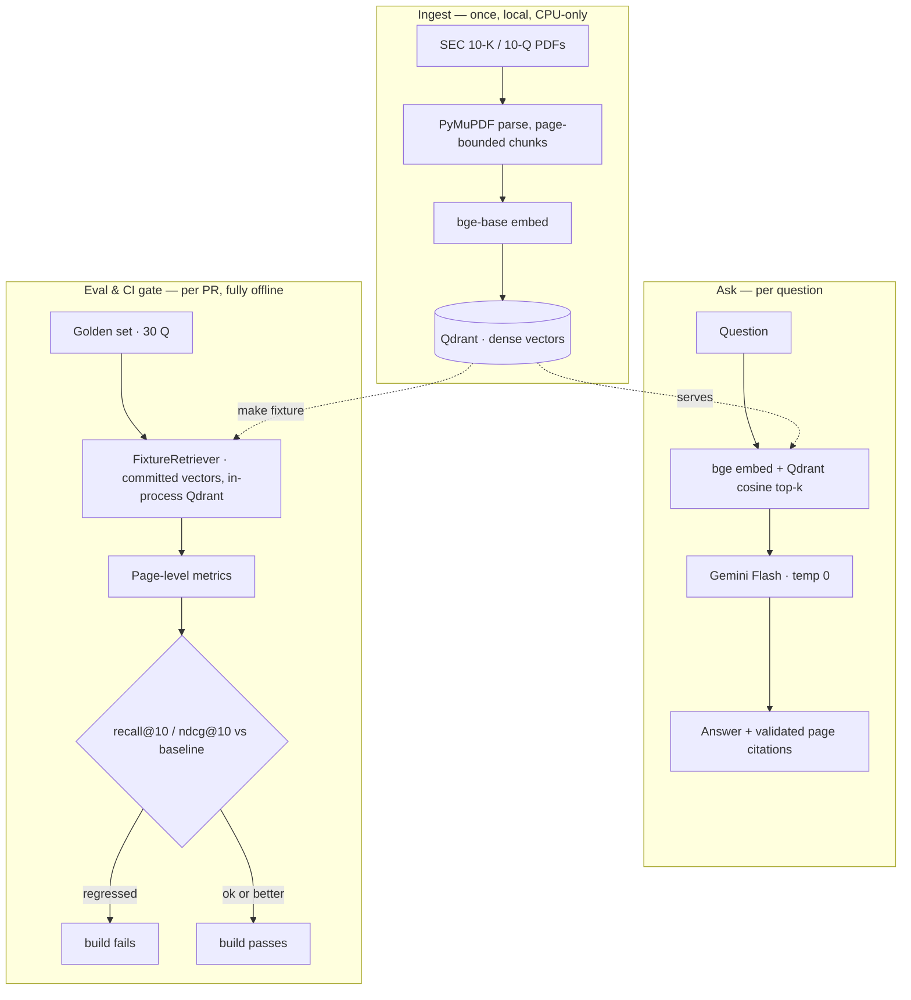

# Ledgion

Ledgion is a retrieval-augmented QA system over SEC filings (10-K/10-Q), benchmarked
against FinanceBench, that cites the exact page every answer comes from. It is built
as a *measured* pipeline: every component is a swappable ablation, and a CI gate
re-runs an offline retrieval eval on each PR and fails the build on regression.

## Architecture

Retrieval is scored on **(doc_id, page)** keys (page numbers are stable across
chunkers), so strategies stay comparable across ablations and a right-page/wrong-filing
match never counts as a hit.

## Baseline

Dense-only retrieval, 30 questions, Gemini Flash at `temperature=0`. Metrics are the
mean over questions, split by whether answering the question needs a figure (numeric)
or narrative (prose).

| Group   |  n | hit@1 |  MRR | nDCG@10 | recall@10 | recall@50 |
|:--------|---:|------:|-----:|--------:|----------:|----------:|
| Overall | 30 | 0.133 | 0.252 |  0.291 |     0.500 |     0.817 |
| Numeric | 16 | 0.188 | 0.304 |  0.330 |     0.531 |     0.938 |
| Prose   | 14 | 0.071 | 0.192 |  0.245 |     0.464 |     0.679 |

**Read:** the evidence page is *found* 82% of the time (recall@50) but *ranked in the
top 10* only 50% of the time — a ranking problem, not a finding problem. Closing that
gap is the goal of the ablations: hybrid BM25 and cross-encoder reranking (both
measured below).

## Hybrid retrieval: measured, not adopted

Phase 6 added a BM25 sparse arm and Reciprocal Rank Fusion, then measured whether
fusing it with dense retrieval helps — at an **equal 50-candidate budget** (hybrid
returns the same number of candidates as dense, so any gain is retrieval quality, not
a bigger pool). It barely does, so the default stays dense.

**Complementarity (dense × sparse, per evidence page, depth 50).** Of 35 golden
evidence pages, sparse finds exactly **one** that dense misses:

|                  | in sparse | not in sparse |
|:-----------------|----------:|--------------:|
| **in dense**     |        11 |            16 |
| **not in dense** |         1 |             7 |

The union recall ceiling is 0.828 — barely above dense's 0.817 — and 7 pages are found
by neither (a floor no fusion of these two can reach). So fusion can only re-rank what
dense already retrieves; it cannot find materially more.

**Weighted-RRF sweep (overall, `dense_weight=1.0`, `rrf_k=60`).**

| Run                       | hit@1 |  MRR | nDCG@10 | recall@10 | recall@50 |
|:--------------------------|------:|-----:|--------:|----------:|----------:|
| dense (baseline)          | 0.133 | 0.252 | 0.291 |     0.500 |     0.817 |
| hybrid · plain · sw1.0    | 0.167 | 0.229 | 0.236 |     0.383 |     0.650 |
| hybrid · plain · sw0.5    | 0.133 | 0.231 | 0.258 |     0.467 |     0.817 |
| hybrid · plain · sw0.25   | 0.167 | 0.265 | 0.280 |     0.467 |     0.817 |
| hybrid · stopwords · sw1.0  | 0.167 | 0.241 | 0.262 |   0.417 |     0.667 |
| hybrid · stopwords · sw0.5  | 0.167 | 0.255 | 0.273 |   0.433 |     0.817 |
| hybrid · stopwords · sw0.25 | 0.200 | 0.288 | 0.305 |   0.450 |     0.817 |

**Why measured, not adopted.** Equal-weight fusion (`sw=1.0`) actively *hurts* — sparse's
noise evicts dense evidence pages from the shared 50-slot budget, dropping recall@50 to
~0.65 — and only a low sparse weight (`sw ≤ 0.5`, where no sparse-only chunk can enter
the top 50, so recall is preserved exactly) trades a small recall@10 dip for a small
early-rank gain (best: stopwords · sw0.25, nDCG@10 +0.014, hit@1 +0.067). Those gains
are marginal and ranking-only, so hybrid ships as a documented, reproducible ablation
rather than the default — the honest next lever is reranking. See
[`DECISIONS.md`](DECISIONS.MD) for the full analysis.

## Reranking: measured, not adopted

Phase 7 added cross-encoder reranking as a stage *after* retrieval — it reorders
whatever dense (or hybrid) returns, so neither arm knows it exists. Scoring is over the
**full reordered candidate pool**, not the 5 chunks served to the model, so recall@k
stays comparable to dense and becomes a *pool-integrity invariant*: reranking permutes
the pool, it never adds to it, so recall@50 must stay **exactly 0.817** on every
top_k=50 row (it did — any drift would be a bug, not a finding). Two rerankers were
compared: `ms-marco-MiniLM-L-6-v2` (22M params) and `bge-reranker-base` (278M).

Latency is p50 in ms per question, retrieval and reranking as separate stages (CPU,
4 threads) — a reranker is a quality-for-cost trade, so both halves are shown.

| Run                    | hit@1 |  MRR | nDCG@10 | recall@10 | recall@50 | retr | rerank |
|:-----------------------|------:|-----:|--------:|----------:|----------:|-----:|-------:|
| dense (baseline)       | 0.133 | 0.252 | 0.291 |    0.500 |     0.817 |   83 |      — |
| dense + MiniLM         | 0.033 | 0.203 | 0.262 |    0.517 |     0.817 |   88 |   4826 |
| dense + bge            | 0.100 | 0.204 | 0.264 |  **0.533** |   0.817 |   97 |  27375 |
| dense · k100           | 0.133 | 0.253 | 0.291 |    0.500 |     0.850 |   83 |      — |
| dense + MiniLM · k100  | 0.033 | 0.191 | 0.262 |    0.533 |     0.844 |  110 |  10860 |
| hybrid + MiniLM        | 0.033 | 0.203 | 0.262 |    0.517 |     0.817 |  120 |   5668 |

(The two `k100` rows pull a 100-candidate pool; their full-depth recall is 0.889, and
that invariant held across the reranked/un-reranked pair too.)

**Why measured, not adopted.** No reranker beats the dense baseline on hit@1, MRR, or
nDCG@10 — both *drop* hit@1 (to 0.033 with MiniLM, 0.100 with bge). `dense + bge` is the
only row to beat baseline recall@10 (0.533 vs 0.500) — the larger model does rescue
buried evidence into the top 10 — but it costs **~27 s/question**, ~285× the retrieval
stage and ~5.7× MiniLM, which doesn't justify adoption. `hybrid + MiniLM` is identical
to `dense + MiniLM` on every metric, confirming that at `sw0.25` the fused pool *is*
dense's pool. The failure is a domain mismatch, not truncation (only 2.3% of
query+chunk pairs exceed the 512-token cap, by ≤25 tokens): MS-MARCO-trained
cross-encoders reward prose that restates the question, while 10-K evidence is a numeric
table whose header does not. Both models' frozen scores are kept for re-measurement at
corpus scale. See [`DECISIONS.md`](DECISIONS.MD) for the full analysis.

## CI gate

Every PR runs `ledgion eval --tier 1 --gate` on a stock runner — no GPU, no network,
no API keys, no model download (so it works on fork PRs too). It scores retrieval
against committed fixtures and **fails the build if recall@10 or nDCG@10 falls more
than 0.02 below the recorded baseline.** Improvements always pass.

A PR that sets `retrieval.top_k: 1` — the gate catches the regression and fails:

Reverting `top_k` back to 50 — the gate passes and the PR is mergeable:

## Limitations

- **Corpus:** 5 filings of FinanceBench's 84 (AMD, Amex, Boeing, PepsiCo, Amcor 10-Ks).
- **Golden set:** 30 questions of FinanceBench's 150.
- **No table-aware parsing:** PyMuPDF extracts plain text; financial tables lose
  structure. Table-aware parsing (Docling) is a planned ablation, not yet included.
- **Faithfulness is measured by citation validation, not an LLM judge:** answers are
  checked deterministically against the pages actually sent to the model; the judged
  (Ragas) tier is off by default and never gates the build.

## Commands

See the `Makefile`: `make ingest`, `make eval` (live), `make fixture` (regenerate the
offline fixtures), `make test`, `make lint`.
