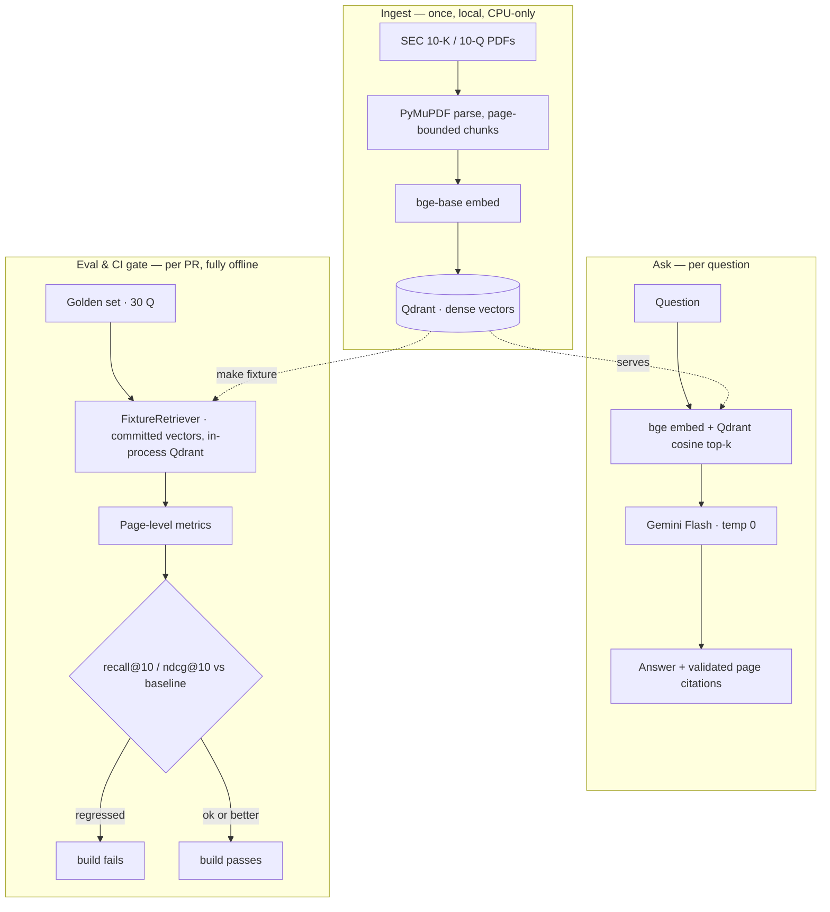

# Ledgion

Ledgion is a retrieval-augmented QA system over SEC filings (10-K/10-Q), benchmarked
against FinanceBench, that cites the exact page every answer comes from. It is built
as a *measured* pipeline: every component is a swappable ablation, and a CI gate
re-runs an offline retrieval eval on each PR and fails the build on regression.

## Architecture

Retrieval is scored at **page level** (page numbers are stable across chunkers), so
strategies stay comparable across ablations.

## Baseline

Dense-only retrieval, 30 questions, Gemini Flash at `temperature=0`. Metrics are the
mean over questions, split by whether answering the question needs a figure (numeric)
or narrative (prose).

| Group   |  n | hit@1 |  MRR | nDCG@10 | recall@10 | recall@50 |
|:--------|---:|------:|-----:|--------:|----------:|----------:|
| Overall | 30 | 0.133 | 0.263 |  0.300 |     0.500 |     0.817 |
| Numeric | 16 | 0.188 | 0.305 |  0.330 |     0.531 |     0.938 |
| Prose   | 14 | 0.071 | 0.216 |  0.265 |     0.464 |     0.679 |

**Read:** the evidence page is *found* 82% of the time (recall@50) but *ranked in the
top 10* only 50% of the time — a ranking problem, not a finding problem. Closing that
gap is the goal of the next ablations (hybrid BM25 retrieval, then reranking).

## CI gate

Every PR runs `ledgion eval --tier 1 --gate` on a stock runner — no GPU, no network,
no API keys, no model download (so it works on fork PRs too). It scores retrieval
against committed fixtures and **fails the build if recall@10 or nDCG@10 falls more
than 0.02 below the recorded baseline.** Improvements always pass.

A PR that sets `retrieval.top_k: 1` — the gate catches the regression and fails:

Reverting `top_k` back to 50 — the gate passes and the PR is mergeable:

## Limitations

- **Corpus:** 5 filings of FinanceBench's 84 (AMD, Amex, Boeing, PepsiCo, Amcor 10-Ks).
- **Golden set:** 30 questions of FinanceBench's 150.
- **No table-aware parsing:** PyMuPDF extracts plain text; financial tables lose
  structure. Table-aware parsing (Docling) is a planned ablation, not yet included.
- **Faithfulness is measured by citation validation, not an LLM judge:** answers are
  checked deterministically against the pages actually sent to the model; the judged
  (Ragas) tier is off by default and never gates the build.

## Commands

See the `Makefile`: `make ingest`, `make eval` (live), `make fixture` (regenerate the
offline fixtures), `make test`, `make lint`.
